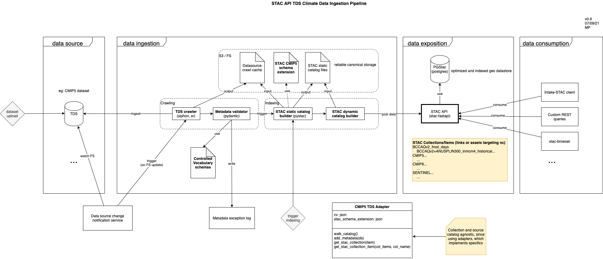

# STAC API TDS Climate Data Ingestion Pipeline PoC

This project shows a PoC of the different parts of the ingestion process.

## High level pipeline view




## Dependencies

Required
- STAC API running at `STAC_HOST` (see `.env.example`)
- THREDDS catalog at `THREDDS_CATALOG` (see `.env.example`)


1. Install requirements

```
pip install -r requirements.txt
```

2. Configure environment variables

```
cp .env.example .env        # then edit .env, see below environment variables usage
```

Environment variables:

```
STAC_HOST               The STAC API endpoint.

THREDDS_CATALOG         The Thredds catalog to crawl.
CRAWL_LIMIT_RESULTS     TEST ONLY, set to True to limit catalog crawl using CRAWL_MAX_ITEM and CRAWL_MAX_OBJ, otherwise set to False.
CRAWL_MAX_ITEM          TEST ONLY, used if CRAWL_LIMIT_RESULTS is set to True, maximum number of items per Thredds catalog level to crawl.
CRAWL_MAX_OBJ           TEST ONLY, used if CRAWL_LIMIT_RESULTS is set to True, maximum number of objects (items or collection) to crawl.
GENERATE_THUMBNAILS     If True, query the WMS getMap to retrieve dataset thumbnail.

BLOB_HOST               Used if GENERATE_THUMBNAILS is set to True, the blob store host URL.
BLOB_BUCKET             Used if GENERATE_THUMBNAILS is set to True, the blob store bucket name.
```

3. Crawl TDS Server and populate STAC API with TDS data

```
python3 -m stac_ingest.main_ingestion_svc
```

4. Browse STAC API

5. Remove all data from STAC API

```
python3 -m stac_ingest.stac_api_data_eraser
```

<hr/>

* To avoid useless queries to Thredds, a file named `tds_cache.json` is created after each run of `tds_crawler.py`. Delete it to crawl Thredds again.

<hr/>


## Schema validation

```
pip install stac-validator
stac_validator ./test_item.json --custom ./schemas/item.json 
```
